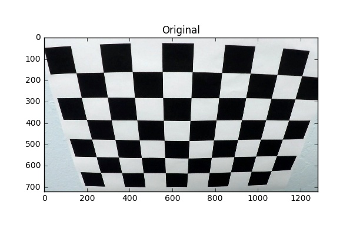
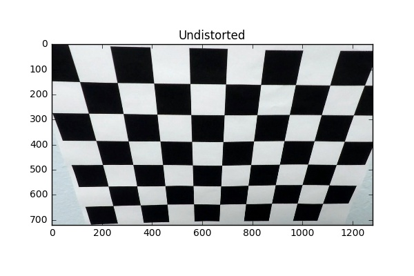
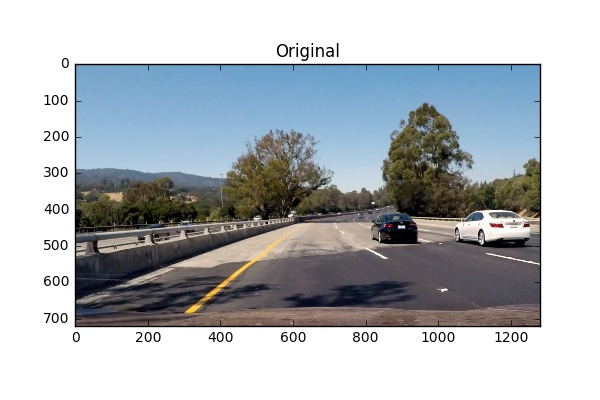
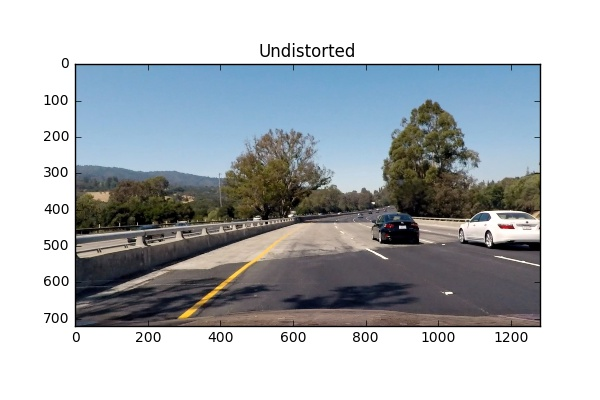
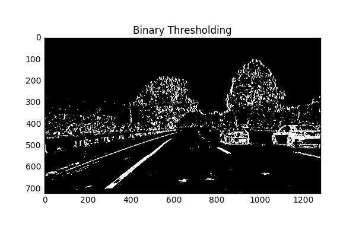
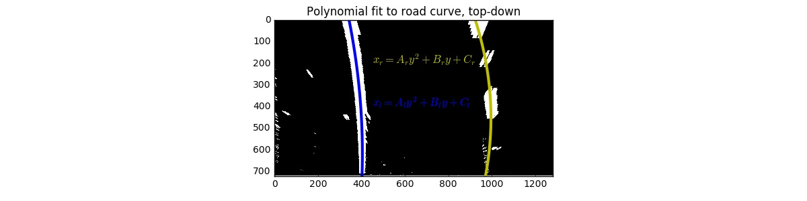
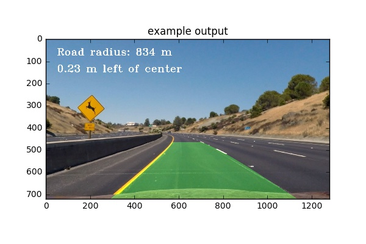

---

**Advanced Lane Finding Project**

The goals / steps of this project are the following:

* Compute the camera calibration matrix and distortion coefficients given a set of chessboard images.
* Apply a distortion correction to raw images.
* Use color transforms, gradients, etc., to create a thresholded binary image.
* Apply a perspective transform to rectify binary image ("birds-eye view").
* Detect lane pixels and fit to find the lane boundary.
* Determine the curvature of the lane and vehicle position with respect to center.
* Warp the detected lane boundaries back onto the original image.
* Output visual display of the lane boundaries and numerical estimation of lane curvature and vehicle position.

[//]: # (Image References)

[image1]: ./examples/undistort_output.png "Undistorted"
[image2]: ./test_images/test1.jpg "Road Transformed"
[image3]: ./examples/binary_combo_example.jpg "Binary Example"
[image4]: ./examples/warped_straight_lines.jpg "Warp Example"
[image5]: ./examples/color_fit_lines.jpg "Fit Visual"
[image6]: ./examples/example_output.jpg "Output"
[video1]: ./project_video.mp4 "Video"

## [Rubric](https://review.udacity.com/#!/rubrics/571/view) Points
###Here I will consider the rubric points individually and describe how I addressed each point in my implementation.  

---
###Writeup / README

####1. Provide a Writeup / README that includes all the rubric points and how you addressed each one.  You can submit your writeup as markdown or pdf.  [Here](https://github.com/udacity/CarND-Advanced-Lane-Lines/blob/master/writeup_template.md) is a template writeup for this project you can use as a guide and a starting point.  

You're reading it!
###Camera Calibration

####1. Briefly state how you computed the camera matrix and distortion coefficients. Provide an example of a distortion corrected calibration image.

The code for this step is contained in the first code cell of the IPython notebook located in "./project.ipynb" (it uses helper functions located in the file called `cameraCalibration.py`).  

First I read in all the available calibration files using glob(). It's important to get as many as possible, because the data is sparse and each calibration image will help normalize the calibration.

I then iterate through each image to prepare "object points", which are the (x, y, z) coordinates of the chessboard corners in the world. Here I am assuming the chessboard is fixed on the (x, y) plane at z=0, such that the object points are the same for each calibration image.  Thus, `objp` is just a replicated array of coordinates, and `objpoints` will be appended with a copy of it every time I successfully detect all chessboard corners in a test image.  `imgpoints` will be appended with the (x, y) pixel position of each of the corners in the image plane with each successful chessboard detection. Here is an example of an image I used to calibrate:

I then used the output `objpoints` and `imgpoints` to compute the camera calibration and distortion coefficients using the `cv2.calibrateCamera()` function.  I applied this distortion correction to the test image using the `cv2.undistort()` function and obtained this result: 

###Pipeline (single images)

####1. Provide an example of a distortion-corrected image.

Now the camera has been calibrated, and we need a process to undistort each image for later manipulation. To demonstrate this step, I will describe how I apply the distortion correction to one of the test images like this one:

The `cv2.calibrateCamera()` function outputs a number of parameters to compensate for lens distortion. I used the 3x3 camera matrix `mtx` and the camera distortion vector `dist` to call `cv2.undistort()` on the road image. This returns an undistorted image, and a modified camera matrix `mtx`. Here is the road image after distortion correction:

####2. Describe how (and identify where in your code) you used color transforms, gradients or other methods to create a thresholded binary image.  Provide an example of a binary image result.

I used a combination of HLS color and gradient thresholds to generate a binary image (thresholding steps can be seen at lines 5 through 14 in `lineDetection.py`). 

The lanes are white or yellow, which makes hue (or RGB color combinations) a poor choice to threshold. Light also changes drastically frame-to-frame, so thresholding on light detection would be spotty going from shadow to sunshine. 

I ultimately used the saturation channel from the HLS color schema and kept all points above 160. I then applied an absolute Sobel threshold in the 'x' dimension, discarding all points under 30 or over 200.

The other possibilities mentioned in the course; an absolute gradient magnitude threshold and a directional gradient threshold, were mostly ineffective. I discarded them for simplicity and speed. Here's an example of my output for this step:

####3. Describe how (and identify where in your code) you performed a perspective transform and provide an example of a transformed image.

The code for my perspective transform includes a function called `warp_image()`, which appears in lines 40 through 46 in the file `cameraCalibration.py` (./cameraCalibration.py).  

The `warp_image()` function takes as inputs an image (`img`), as well as source (`src`) and destination (`dst`) points.  I chose to hardcode the source and destination points by hand via evaluating approximate pixel coordinates along the inside of the lane markings. This resulted in the following source and destination points:

| Source        | Destination   | 
|:-------------:|:-------------:| 
| 270, 680      | 350, 700      | 
| 1040, 680     | 950, 700      |
| 730, 480      | 950, 200      |
| 550, 480      | 350, 200      |

I verified that my perspective transform was working as expected by drawing the `src` and `dst` points onto a test image and its warped counterpart to verify that the lines appear parallel in the warped image. The following images show this result on an image of a segment of straight highway.

####4. Describe how (and identify where in your code) you identified lane-line pixels and fit their positions with a polynomial?

The function `process_image()`, on lines 225-236 in the file `laneSegmentation.py` is the pipeline for undistorting lanes and detecting lines within a single image file.

Once the image has been warped and binary lines are available, most of the action occurs within the `Line()` class. The `update_line` function acts as an entry point to determine the positioning of the lane lines.

It first calls `gen_fit_data`, the first real step is then to guess the best line position; depending on whether it is a left or right lane. This relies heavily on heuristics- knowing the camera will always be relatively static compared to the lanes. It will fail if the camera is flipped or rotated drastically.

I create a histogram of active pixels across the x dimension, then find the peak by iterating over either the left or right side, according to the expected line parameter. This ensures only a single peak value is found across x under normal conditions. This peak correlates to the lane line.

I then create an array with a finite x-width of 100 to evaluate the line along the y dimension. I create another histogram and calculate a weighted average of those values to determine the line center point. I then keep all the points within a fixed frame from the line's center, and calculate a polynomial fit from those.

You can see an example of the polynomial fit here:

####5. Describe how (and identify where in your code) you calculated the radius of curvature of the lane and the position of the vehicle with respect to center.

I did this in cell 9 of the notebook, making use of the `update_line()` function found in lines 17 through 33 in `laneSegmentation.py`

I derived an approximate conversion factor for the unwarped pixels to real-world meters, using the size of the lane from multiple images. I used this to convert the drift from center into meters, by simply taking the middle x pixels and the relative position of each line. I was also able to convert the polynomial fit to real-world meters using the formula:

R = |(1+y'^2)^(3/2) / y''|

This provided a radius to verify the accuracy of this system. The accuracy was reasonable - I obtained a radius along the curve of ~ 750m. I'm within one standard deviation from the base truth!

To find the vehicle position with respect to center, I simply compared the center of the image to the average of the x coordinates of the two lane lines. This assumes the camera was mounted in the center, and doesn't favor pixels nearer the vehicle, so some inaccuracy should be expected during curves.

####6. Provide an example image of your result plotted back down onto the road such that the lane area is identified clearly.

This method is the same as what will later be used in the video pipeline, barring the checks for consistent results frame-to-frame. I used the inverse transform matrix to convert the lane marking polygon to the original perspective, and overlayed it along with the position and curvature of the vehicle. I implemented this step in lines 238 through 254 in my code in `laneSegmentation.py` in the function `update_lane()`.  Here is an example of my result on a test image:

---

###Pipeline (video)

####1. Provide a link to your final video output.  Your pipeline should perform reasonably well on the entire project video (wobbly lines are ok but no catastrophic failures that would cause the car to drive off the road!).

The final pipeline runs through the function `update_lane` which returns the overlayed road markings and associated metadata.

Here's a [link to my video result](./result_video.mp4)

---

###Discussion

####1. Briefly discuss any problems / issues you faced in your implementation of this project.  Where will your pipeline likely fail?  What could you do to make it more robust?

This project was difficult due to the perspective transforms and tuning. Detecting the lines was relatively straightforward, because the left/right consistency enabled a very strong heuristic approach. I tried a few approaches and discussed successful approaches with fellow students.

Saturation appears to be the best candidate for discovering the lane lanes, which is why I ultimately opted for HLS, but of course it will lead to issues in environments where similarly saturated colors are expected. For example, following bright yellow vehicles; or the opposite, where all saturation is washed out by fog or snow.

Also, in a previous project I used the Hough transform to evaluate lines. I think this might be a useful algorithm after the perspective transform, although difficult to use because the Hough transform is rather sticky about whether it's detecting a straight line or a curve. As the curve becomes nearly straight, a Hough circle would approach infinite radius. Computers HATE infinity!

Finally, this system relies heavily on heuristics - a more robust approach would be sensor fusion; for example using parallax cameras in the cabin, or additional low-res cameras on the bumpers. Overall I enjoyed learning a lot about numpy through this lab, and getting stumped by data type errors! I also found the ipython notebook format worked quite well for iterating and evaluating- it's starting to grow on me.

